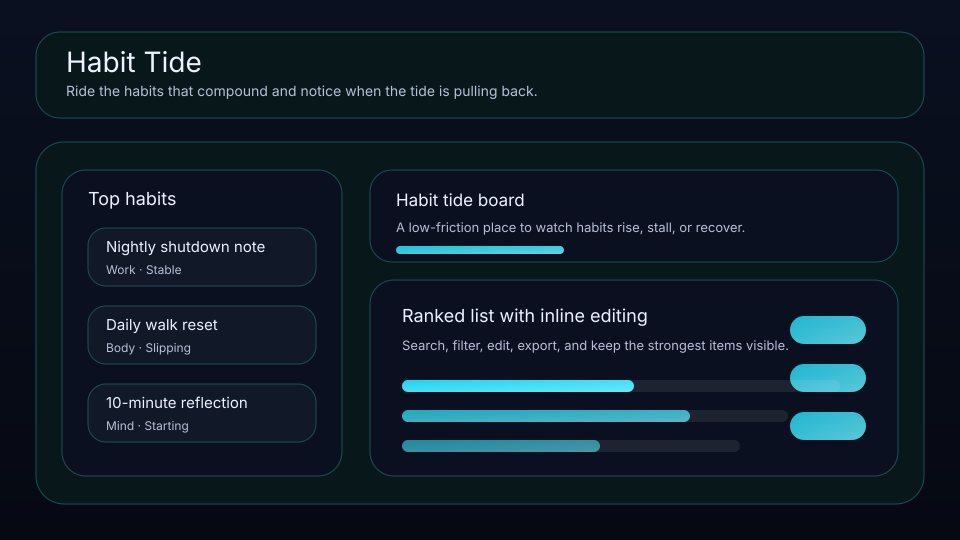

# Habit Tide

Ride the habits that compound and notice when the tide is pulling back.



Habit Tide is a local-first workspace for founders, operators, and solo builders who want a cleaner way to manage habits. It keeps consistency, cue, next reset, and review timing visible so the right things move forward with less drift.

## What it does

- ranks habits by leverage, consistency, timing, and friction
- tracks **cue**, **next reset**, **next check-in**, and **consistency** for each habit
- highlights the best current bet, the next review slot, and the strongest signal on the board
- renders a dedicated queue plus a category mix snapshot beneath the main board
- saves locally in the browser with JSON import/export backups
- quick action: **Log today**
- quick action: **Run reset**
- quick action: **Mark slipping**

## Why it feels different

Habit Tide is not just a generic list. It is shaped around the real workflow behind habits, so the board helps you decide what matters next instead of simply storing records.

## Quick start

```bash
git clone https://github.com/get2salam/habit-tide.git
cd habit-tide
python -m http.server 8000
```

Then open <http://localhost:8000>.

## Verify the bundle

A no-dependency sanity check before committing:

```bash
node --check js/main.js
```

The same command runs on every push and pull request in
[`.github/workflows/pages.yml`](.github/workflows/pages.yml). Pushes
to `main` then publish the static site to GitHub Pages — enable Pages
once under **Settings → Pages → Source: GitHub Actions** and the
workflow takes over.

## Keyboard shortcuts

- `N` creates a new habit
- `/` focuses the search box

## Privacy

Everything stays in your browser unless you export a JSON backup.

## License

MIT
